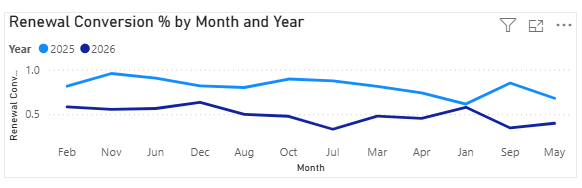

# 📊 Car Insurance Renewal Conversion Analysis

## 🎯 Project Overview

This project investigates the decline in the insurance renewal conversion rate from **82% in 2025** to **50% in 2026**. The objective is to determine whether merging the **Renewals** and **New Business** lines of business into a single agent role negatively affected renewal performance.

The analysis was performed using **Microsoft Excel** for data preparation and **Power BI** for data modeling, DAX calculations, and interactive dashboard development.

---

## 🚨 Problem Statement

In 2025, agents specialized in either **Renewals** or **New Business**, allowing them to focus on a single line of business. Beginning in 2026, management combined both responsibilities into one role.

Following this organizational change, renewal conversion dropped from approximately **82%** to **50%**.

This project aims to answer the following questions:

- Did merging the two Lines of Business impact renewal conversion?
- Did the increased workload contribute to lower conversion rates?
- What recommendations can improve renewal performance?

---

## 📂 Dataset Description

The dataset simulates an car insurance company's renewal portfolio and contains policy-level information for both 2025 and 2026.

### Tables

- Policies
- Agents

### Key Fields

- Policy_ID	
- Customer_ID	
- Year	
- Month		
- Insurance_Provider	
- Agent	
- Agent_Role	
- LOB_Model	
- Business_Type	
- Lead_Date	
- Renewal_Due	
- Premium	
- Workload	
- Followups	
- Dial_Count	
- Avg_Call_Min	
- Status	
- Lost_Reason	
- Revenue

---

## 🧹 Data Cleaning

The following data quality checks were performed:

- ✅ Standardized text formatting
- ✅ Trimmed extra spaces
- ✅ Converted mixed date formats
- ✅ Corrected inconsistent values
- ✅ Verified data types
- ✅ Built Calendar table for time intelligence

---

## 🔍 Methodology

The analysis followed these steps:

1. Cleaned and validated the dataset in Microsoft Excel.
2. Imported the cleaned data into Power BI.
3. Created relationships using a star schema.
4. Built an interactive dashboard to compare renewal performance between 2025 and 2026.
6. Analyzed workload changes and renewal conversion trends.

---

## Tools & Technologies

| Tool | Purpose |
|------|---------|
| 📊 Microsoft Excel | Data cleaning, validation, and preparation |
| 📈 Power BI | Data modeling, dashboard creation, and visualization |
| 📐 DAX | Business metrics |

---

---

# 📈 Dashboard

## 1. Renewal Conversion % by Month and Year

### Insight

- Renewal conversion remained consistently high throughout 2025, averaging approximately **82%**.
- After the LOB merge in 2026, renewal conversion dropped to around **50%** across most months.
- The trend indicates a sustained decline rather than a seasonal fluctuation.

---

## 2. Renewal Conversion % by LOB Model

### Insight

- Specialized agents achieved approximately **82%** renewal conversion.
- Combined-role agents achieved only **50%**.
- This suggests that specialization produced stronger renewal performance.

---

## 3. KPI Summary

### Insight

| Year | LOB Model | Average Workload | Renewal Conversion |
|------|-----------|----------------:|-------------------:|
|2025|Specialized|27.41|82%|
|2026|Combined|47.34|50%|

Key observations:

- Average workload increased from **27.41** to **47.34** policies per agent.
- Renewal conversion decreased by approximately **32 percentage points**.
- Policies lost increased from **146** to **248**.

---

## 🚀 Recommendations

Based on the analysis:

- Reintroduce specialized renewal teams for high-value renewal portfolios.
- Balance workloads across agents to reduce operational overload.
- Monitor agent workload alongside renewal conversion KPIs.
- Implement automated renewal reminders and follow-up processes.

---

# 🛠️ Tools & Technologies

| Tool | Purpose |
|------|---------|
| 📊 Microsoft Excel | Data collection, data validation, and initial data preparation |
| 📈 Power BI | Data modeling, interactive dashboards, KPI reporting, and data visualization |
| 📐 DAX | Business calculations and KPI measures |

---

## Author

**Mark Manongsong**

Data Analytics Portfolio Project
