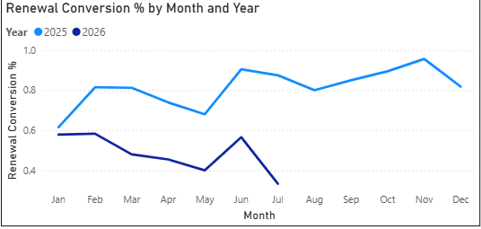
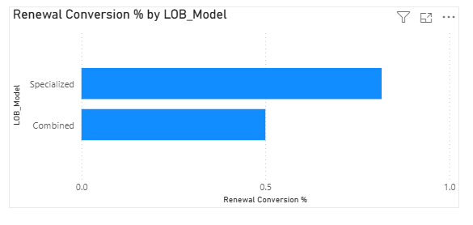
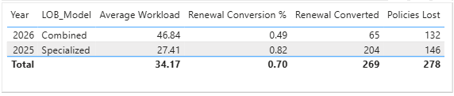

# 📊 Car Insurance Renewal Conversion Analysis

## 🎯 Project Overview

This project analyzes the relationship between the insurance sales operating model, agent workload, and renewal performance following the transition from **Specialized Agents (2025)** to **Combined Agents (2026)**.

In 2025, agents handled either **Renewals** or **New Business** exclusively. Beginning in 2026, both responsibilities were merged into a single role. This analysis evaluates the relationship between the operating model, agent workload, and renewal conversion performance.

The project was completed using **Microsoft Excel** for data preparation and **Power BI** for data modeling, DAX measures, and interactive dashboard development.

---

# 🚨 Problem Statement

Renewal conversion declined from 82% in 2025 to 49% in 2026 following the implementation of a new operating model in which agents handled both Renewals and New Business. This project examines the relationship between the operating model, agent workload, and renewal conversion to identify data-driven opportunities for improving renewal performance.

---

# 📂 Dataset Description

This project uses a simulated car insurance renewal dataset containing approximately **1,000 policy records** covering renewal activities from 2025 to 2026.

### Tables

- Policies
- Agents

### Key Fields

- Policy_ID
- Customer_ID
- Year
- Month
- Insurance_Provider
- Agent
- Agent_Role
- LOB_Model
- Business_Type
- Lead_Date
- Renewal_Due
- Premium
- Workload
- Followups
- Dial_Count
- Avg_Call_Min
- Status
- Lost_Reason
- Revenue

---

## 📖 Data Dictionary

The table below describes the key fields used throughout the analysis.

| Column             | Description                                                                                                 |
| ------------------ | ----------------------------------------------------------------------------------------------------------- |
| **Policy_ID**      | Unique identifier assigned to each insurance policy.                                                        |
| **Customer_ID**    | Unique identifier for each customer.                                                                        |
| **LOB**            | Line of Business (e.g., Auto, Motorcycle, Commercial Vehicle).                                              |
| **Business_Type**  | Indicates whether the policy is **New Business** or **Renewal**.                                            |
| **Status**         | Renewal outcome of the policy (Converted or Lost).                                                          |
| **Premium**        | Insurance premium amount associated with the policy.                                                        |
| **Effective_Date** | Date when the insurance policy became effective.                                                            |
| **Renewal_Date**   | Scheduled date for policy renewal.                                                                          |
| **Year**           | Calendar year extracted from the renewal date for trend analysis.                                           |
| **Month**          | Calendar month used to analyze monthly renewal performance.                                                 |
| **Month_Number**   | Numeric representation of the month (1–12) used to ensure chronological sorting in Power BI visualizations. |

### Notes

* **LOB (Line of Business)** categorizes insurance products into different product lines for comparison.
* **Business_Type** distinguishes new policy sales from renewal transactions.
* **Status** is the primary field used to calculate the **Renewal Conversion Rate**.
* **Month_Number** was created during data preparation to correctly display months in chronological order within Power BI.

# 🧹 Data Cleaning

Data preparation was performed in Microsoft Excel.

Cleaning activities included:

- ✅ Standardized text values
- ✅ Trimmed extra spaces
- ✅ Converted inconsistent date formats
- ✅ Corrected invalid and inconsistent values
- ✅ Verified numeric and date data types
- ✅ Validated numeric fields
- ✅ Prepared the dataset for Power BI modeling

---

# 🔍 Methodology

The project followed these steps:

1. Cleaned and validated the raw dataset using Microsoft Excel.
2. Imported the cleaned dataset into Power BI.
3. Created DAX measures for KPIs.
4. Designed an interactive dashboard.
5. Compared renewal performance between Specialized and Combined operating models.
6. Evaluated the relationship between workload and renewal conversion.

---

# 📈 Dashboard

## 1. Renewal Conversion % by Month and Year

### Key Findings

- **2025** maintained a consistently high renewal conversion rate, averaging approximately **82%**.
- **2026** experienced a noticeable decline, averaging approximately **49%**.
- The decline persisted throughout the available months (January–July), suggesting that the lower renewal conversion was consistent during the observed period.

---

## 2. Renewal Conversion % by LOB Model

### Key Findings

- **Specialized Model (2025): 82% Renewal Conversion**
- **Combined Model (2026): 49% Renewal Conversion**

The dashboard shows that the Specialized operating model consistently outperformed the Combined model by approximately **33 percentage points**, suggesting that dedicated renewal specialists achieved higher conversion rates.

---

## 3. KPI Summary

### Summary

| Year | LOB Model | Average Workload | Renewal Conversion | Renewals Converted | Policies Lost |
|------|-----------|----------------:|-------------------:|------------------:|--------------:|
|2025|Specialized|27.41|82%|204|146|
|2026|Combined|46.84|49%|65|132|

### Business Insights

- Average workload increased from **27.41** to **46.84** policies per agent (**~71% increase**).
- Renewal conversion declined from **82%** to **49%**.
- Although the 2026 dataset only includes **January–July**, renewal conversion remained significantly below 2025 levels.
- The findings suggest that assigning agents to both New Business and Renewals was associated with lower renewal conversion and higher workloads.

---

### Key Business Impact

📉 Renewal conversion declined by 33 percentage points, from 82% in 2025 to 49% in 2026.
📈 Average agent workload increased by approximately 71%, from 27.41 to 46.84 policies per agent.
📊 The findings suggest that higher workloads were associated with lower renewal conversion performance.
🎯 The dashboard enables managers to monitor renewal conversion, agent workload, and operational KPIs to evaluate future process changes and support data-driven decision-making.

---

# 📊 Overall Findings

The analysis indicates a strong relationship between increased workload and declining renewal performance.

Key observations include:

- Specialized agents consistently achieved higher renewal conversion.
- Combined-role agents managed substantially larger workloads.
- Increased workload coincided with lower renewal conversion rates.
- The analysis suggests that the transition to a combined operating model was associated with increased agent workload and lower renewal conversion performance.

---

# 🚀 Recommendations

Based on the findings, the following actions are recommended:

- Reintroduce specialized renewal agents for high-value renewal portfolios.
- Balance workloads across agents to reduce operational overload.
- Monitor workload alongside renewal conversion KPIs.
- Regularly review conversion performance after operational changes to measure business impact.

---

# 🛠️ Tools & Technologies

| Tool | Purpose |
|------|---------|
| 📊 Microsoft Excel | Data cleaning, validation, and preparation |
| 📈 Power BI | Data modeling, dashboard development, and visualization |
| 📐 DAX | KPI calculations and business measures |

---

# 📌 Key Skills Demonstrated

- Data Cleaning
- Data Modeling
- Power BI Dashboard Development
- DAX Measures
- KPI Reporting
- Business Analysis
- Trend Analysis
- Data Visualization

---

## 👤 Author

**Mark Manongsong**

Data Analytics Portfolio Project
